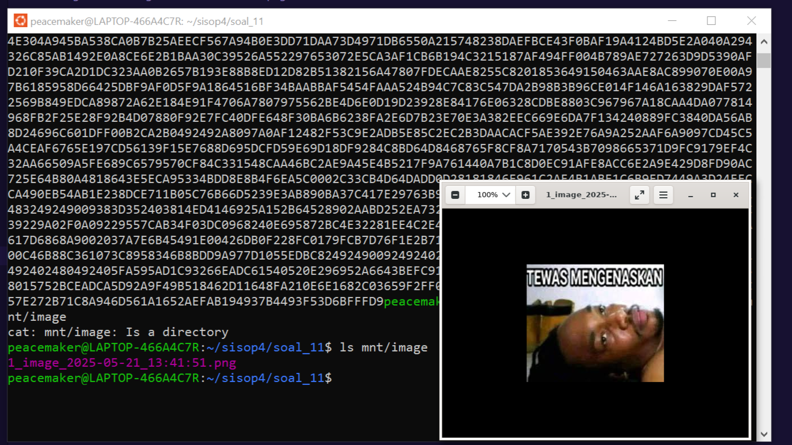
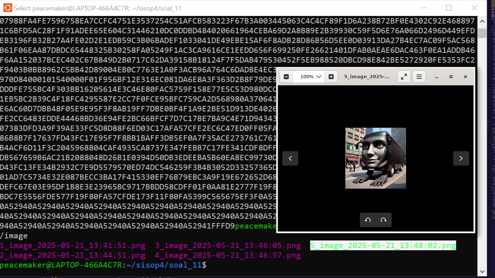
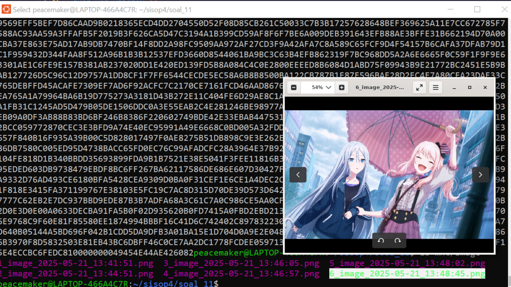
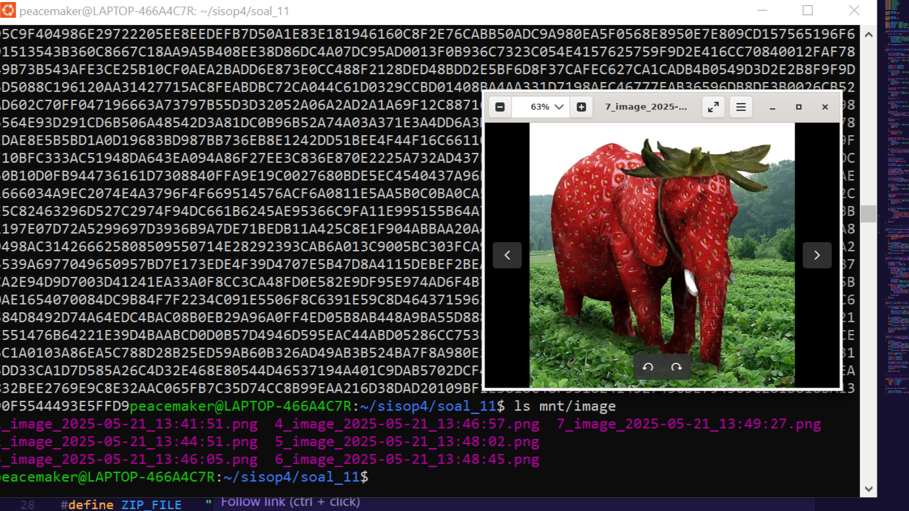

# Sisop-4-2025-IT33

#### Nama Anggota
1. Revalina Erica Permatasari (5027241007)
2. Kaisar Hanif Pratama (5027241029)
3. Ni'mah Fauziyyah Atok (5027241103)

## Daftar Isi
1. [Soal 1](#soal-1)
2. [Soal 2](#soal-2)
3. [Soal 3](#soal-3)
4. [Soal 4](#soal-4)

## Soal 1
### Oleh: Ni'mah Fauziyyah A (5027241103)

### Soal
Shorekeeper, penjaga Black Shores, menemukan anomali misterius berupa **file teks berisi string hexadecimal**. <br>
Tugasnya adalah membantu Shorekeeper memecahkan misteri ini dengan:

- Mengunduh dan mengekstrak file sampel dari internet
- Mengonversi string hexadecimal menjadi **file gambar** `.png`
- Menyimpan gambar ke folder khusus
- Mencatat semua proses ke dalam **log file** <br>

Konversi dilakukan secara otomatis saat file teks diakses melalui filesystem virtual (menggunakan FUSE). <br>
Berikut ini adalah rincian solusi berdasarkan soal poin **a sampai d**.

### Jawaban

#### A. Download dan Unzip File
Sampe anomali teks terdapat pada [LINK BERIKUT] (https://drive.google.com/file/d/1hi_GDdP51Kn2JJMw02WmCOxuc3qrXzh5/view)
##### Kode
```
static void setup_environment(void)
{
    struct stat st = {0};

    if (stat(SOURCE_DIR, &st) == -1) {
        printf("[INFO] Downloading and extracting %s…\n", ZIP_FILE);
        system("wget -q --show-progress -O " ZIP_FILE " \"" ZIP_URL "\"");
        system("unzip -q " ZIP_FILE " -d .");
        unlink(ZIP_FILE);
    }

    if (stat(IMAGE_DIR, &st) == -1) {
        mkdir(IMAGE_DIR, 0755);
    }
}
```
##### Penjelasan
- Mengecek keberadaan folder `anomali` dan `anomali/image` dengan `stat()`.
- Jika belum ada: <br>
    - Mengunduh file dari Google Drive via `wget`
    - Mengekstrak menggunakan `unzip`
    - Menghapus file .zip dengan `unlink()`
- Folder `image` dibuat jika belum tersedia agar bisa menyimpan file gambar hasil konversi.

#### B. Konversi String Hexadecimal ke Gambar
Setiap file teks berisi data hexadecimal harus: <br>
1. Dibuka dan dibaca
2. Difilter agar hanya menyisakan karakter hex
3. Dikonversi ke byte biner
4. Disimpan sebagai file `.png` di `anomali/image/`

##### Kode
Fungsi `convert_file_to_image()` menangani proses ini: <br>
```
static int convert_file_to_image(const char *txt_name)
{
    char src_path[PATH_MAX];
    snprintf(src_path, sizeof(src_path), "%s/%s", SOURCE_DIR, txt_name);

    FILE *src = fopen(src_path, "r");
    if (!src) return -1;

    fseek(src, 0, SEEK_END);
    long fsize = ftell(src);
    fseek(src, 0, SEEK_SET);
    char *raw = malloc(fsize + 1);
    fread(raw, 1, fsize, src);
    raw[fsize] = '\0';
    fclose(src);

    char *hex = malloc(fsize + 1);
    long hlen = 0;
    for (long i = 0; i < fsize; ++i) {
        if (isxdigit((unsigned char)raw[i])) {
            hex[hlen++] = raw[i];
        }
    }
    hex[hlen] = '\0';
    free(raw);

    if (hlen % 2 != 0) {
        fprintf(stderr, "[WARN] Odd number of hex digits in %s, skipping.\n", txt_name);
        free(hex);
        return -1;
    }

    unsigned char *bin = malloc(hlen / 2);
    long real_len = 0;
    for (long i = 0; i < hlen / 2; ++i) {
        if (sscanf(hex + 2 * i, "%2hhx", &bin[real_len]) == 1) {
            real_len++;
        }
    }
    free(hex);
```
##### Penjelasan
- File `.txt` dibaca seluruhnya, hasilnya disimpan ke buffer `raw`
- Karakter non-hex diabaikan, hanya `0-9, a-f, A-F` yang disimpan di `hex`
- Validasi: jumlah karakter hex harus genap untuk membentuk byte
- Hexadecimal diubah menjadi byte `(unsigned char)` menggunakan `sscanf()`
- Data biner ini kemudian akan ditulis sebagai file gambar

#### C. Format Penamaan File Output
File gambar hasil konversi harus dinamai sebagai berikut: <br>
```
[nama file string]_image_[YYYY-mm-dd]_[HH:MM:SS].
```

##### Kode
Kode Penamaan File:
```
time_t now = time(NULL);
struct tm tm_now;
localtime_r(&now, &tm_now);

char ts[32];
strftime(ts, sizeof(ts), "%Y-%m-%d_%H:%M:%S", &tm_now);

char base[256];
strncpy(base, txt_name, sizeof(base));
char *dot = strrchr(base, '.');
if (dot) *dot = '\0';

char out_path[PATH_MAX];
snprintf(out_path, sizeof(out_path),
         "%s/%s_image_%s.png", IMAGE_DIR, base, ts);
```
##### Penjelasan
- `time()` mendapatkan waktu saat ini
- `strftime()` mengubah waktu menjadi string dengan format tanggal dan jam
- Nama dasar file diambil tanpa ekstensi `.txt`
- Hasil akhir disusun menjadi nama file gambar seperti `2_image_2025-05-19_20:15:43.png`

#### D. Logging Hasil Konversi
Semua konversi sukses dicatat dalam `conversion.log` dengan format:
```
[YYYY-mm-dd][HH:MM:SS]: Successfully converted hexadecimal text [input.txt] to [output.png]
```

##### Kode
```
FILE *logf = fopen(LOG_FILE, "a");
if (logf) {
    fprintf(logf,
        "[%04d-%02d-%02d][%02d:%02d:%02d]: Successfully converted hexadecimal text %s to %s.\n",
        tm_now.tm_year + 1900, tm_now.tm_mon + 1, tm_now.tm_mday,
        tm_now.tm_hour, tm_now.tm_min, tm_now.tm_sec,
        txt_name, strrchr(out_path, '/') + 1);
    fclose(logf);
}
```
##### Penjelasan
- Log dibuka dalam mode append (`a`)
- Informasi timestamp dan nama file asal serta file hasil dicatat ke file log
- Penggunaan `strrchr(out_path, '/') + 1` digunakan untuk mengambil nama file output saja (tanpa path)

#### E. Kesimpulan
Program ini berhasil memenuhi seluruh poin:
- (a) Download & unzip otomatis
- (b) Parsing string hexadecimal ke gambar
- (c) Penamaan file sesuai waktu konversi
- (d) Logging hasil konversi secara real-time

Semuanya dilakukan secara otomatis saat file teks dibuka melalui sistem file virtual (FUSE). Program ini efektif untuk mendeteksi dan memulihkan data gambar tersembunyi dari teks hexadecimal.

---
### Kendala
Selama proses saya mengerjakan nomor 1, saya mengalami kendala saat mencoba mendekripsi isi file teks menjadi gambar. Masalah utamanya adalah:

#### Masalah
1. Konversi berulang <br>
Beberapa file terkonversi lebih dari satu kali saat diakses, meskipun gambar sudah pernah dibuat sebelumnya. Hal ini terjadi karena:
    - Fungsi `convert_file_to_image()` selalu membuat file baru dengan timestamp (_image_<timestamp>.png).
    - Sementara itu, pengecekan apakah file sudah pernah dikonversi hanya melihat keberadaan file dengan nama tetap (`*_image.png`) yang sebenarnya tidak pernah dibuat.
2. Proses Baca yang Lambat atau tidak muncul
Beberapa file seperti 3.txt dan 6.txt membutuhkan waktu lama untuk ditampilkan menggunakan cat, bahkan hanya muncul setelah dihentikan dengan Ctrl+C. Ini disebabkan oleh pemanggilan fungsi konversi yang berulang kali terjadi di dalam fungsi read(), yang membuat proses macet atau berat.
3. Duplikasi Log
Untuk beberapa file, meskipun gambar hanya dibuat satu kali, catatan log (`conversion.log`) menunjukkan bahwa proses konversi tercatat dua kali. Ini terjadi karena fungsi `convert_file_to_image()` kemungkinan dipanggil lebih dari sekali dalam waktu singkat.

#### Solusi & Revisi 
Untuk mengatasi masalah-masalah tersebut, dilakukan beberapa perbaikan berikut:
1. Perbaikan Mekanisme Pengecekan File Gambar
    - Mengecek keberadaan satu file (`*_image.png`), sistem kini menggunakan pencarian terhadap file dengan pola prefix (`*_image_`) untuk memastikan apakah konversi sudah pernah dilakukan.
    - Hal ini mencegah proses konversi berulang karena nama file hasil konversi menggunakan timestamp.

2. Optimasi Fungsi `xmp_read()`
    - Membuat logika pengecekan yang lebih ketat sebelum memanggil `convert_file_to_image()`.
    - Mngurangi terjadinya proses konversi ganda selama proses `read()` dilakukan secara bertahap oleh aplikasi seperti `cat` atau `less.`

3. Pencegahan Duplikasi Log
Konversi hanya dilakukan jika memang belum ada file hasil konversi sebelumnya, sehingga log hanya mencatat proses konversi yang benar-benar terjadi.

### Dokumentasi
Dokumentasi pengerjaan nomor 1 <br> <br>

#### [1] Jika dijalankan ` ./hexed -f -o allow_other mnt`
Perintah `./hexed -f -o allow_other mnt` akan download, unzip, dan menjalankan FUSE di Foreground dikarenakan saya menggunakan `-f`
 <br>

### [2] Jika dijalankan `cat mnt/1.txt` / Membuka isi file 1.txt dan converted ke file image
Membuka terminal baru dan melihat isi file 1.txt di dalam folder mnt yang dijalankan FUSE dan jika filenya dibuka akan terkonversi ke dalam file image. Berikut jika dijalankan `cat mnt/1.txt` , `ls mnt/image`, dan saya juga menampilkan isi dari file image yang sudah terkonversi di image viewes linux untuk melihat gambar yang berjalan di FUSE / mnt. <br>
 <br>

### [3] Jika dijalankan `cat mnt/2.txt` / Membuka isi file 2.txt dan converted ke file image
Membuka isi file, check isi dalam folder image `ls mnt/image`, dan menampilkan gambar <br>
 <br>

### [4] Jika dijalankan `cat mnt/3.txt` / Membuka isi file 3.txt dan converted ke file image
Membuka isi file, check isi dalam folder image `ls mnt/image`, dan menampilkan gambar <br>
 <br>

### [5] Jika dijalankan `cat mnt/4.txt` / Membuka isi file 4.txt dan converted ke file image
Membuka isi file, check isi dalam folder image `ls mnt/image`, dan menampilkan gambar <br>
 <br>

### [6] Jika dijalankan `cat mnt/5.txt` / Membuka isi file 5.txt dan converted ke file image
Membuka isi file, check isi dalam folder image `ls mnt/image`, dan menampilkan gambar <br>
 <br>

### [7] Jika dijalankan `cat mnt/6.txt` / Membuka isi file 6.txt dan converted ke file image
Membuka isi file, check isi dalam folder image `ls mnt/image`, dan menampilkan gambar <br>
 <br>

### [8] Jika dijalankan `cat mnt/7.txt` / Membuka isi file 7.txt dan converted ke file image
Membuka isi file, check isi dalam folder image `ls mnt/image`, dan menampilkan gambar <br>
 <br>

### [9] Isi dari tree
 <br>

### [9] Menghentikan FUSE dengan Ctrl+C
Otomatis folder mnt akan kosong, karena FUSE sudah tidak berjalan lagi
 <br>

### [10] Isi dari conversion.log
 <br>

---
## Soal 2
### Oleh: Kaisar Hanif Pratama (5027241029)

## Soal 3
### Oleh: Revalina Erica Permatasari (5027241007)

#### `docker-compose.yml` (Eksternal)
##### Code Sebelum Revisi
```
version: '3.8'
services:
  antink-server:
    build: .
    container_name: antink-server
    privileged: true
    cap_add:
      - SYS_ADMIN
    devices:
      - /dev/fuse
    volumes:
      - ./it24_host:/it24_host
      - ./antink_mount:/antink_mount
      - ./antink_logs:/var/log
  
  antink-logger:
    image: busybox
    container_name: antink-logger
    depends_on:
      - antink-server
    volumes:
      - ./antink_logs:/var/log
    command: sh -c "while [ ! -f /var/log/it24.log ]; do sleep 1; done; tail -f /var/log/it24.log"
```

##### Code Sesudah Revisi
```
version: '3.8'

services:
  antink-server:
    build: .
    container_name: antink-server
    privileged: true
    cap_add:
      - SYS_ADMIN
    devices:
      - /dev/fuse
    volumes:
      - ./it24_host:/it24_host:ro   
      - ./antink_mount:/antink_mount 
      - ./antink_logs:/var/log     
    security_opt:
      - apparmor:unconfined

  antink-logger:
    image: busybox
    container_name: antink-logger
    depends_on:
      - antink-server
    volumes:
      - ./antink_logs:/var/log:ro    
    command: sh -c "while [ ! -f /var/log/it24.log ]; do sleep 1; done; tail -f /var/log/it24.log"

volumes:
  it24_host:   
  antink_mount:  
  antink_logs: 
```

##### Service: `antink-server`
Container utama yang menjalankan sistem FUSE AntiNK.

| Baris | Penjelasan |
|-------|------------|
| `build: .` | Membangun image Docker dari `Dockerfile` di direktori saat ini. |
| `container_name: antink-server` | Nama container akan menjadi `antink-server`. |
| `privileged: true` | Memberikan hak akses penuh pada container, **diperlukan untuk menjalankan FUSE**. |
| `cap_add:`<br>`- SYS_ADMIN` | Menambahkan kemampuan khusus agar container bisa melakukan operasi `mount` (diperlukan untuk FUSE). |
| `devices:`<br>`- /dev/fuse` | Memberikan akses langsung ke device FUSE pada host. |
| `volumes:`<br>`- ./it24_host:/it24_host:ro` | Mount direktori `it24_host` dari host sebagai sumber file asli. Bersifat **read-only**. |
|  | `- ./antink_mount:/antink_mount` >> Mount point FUSE, tempat hasil virtual dari sistem AntiNK ditampilkan. |
|  | `- ./antink_logs:/var/log` >> Tempat log sistem disimpan, termasuk `it24.log`. |
| `security_opt:`<br>`- apparmor:unconfined` | Menonaktifkan profil keamanan AppArmor agar tidak menghalangi operasi FUSE. |
---

##### Service: `antink-logger`
Container ringan untuk memantau log sistem secara real-time.

| Baris | Penjelasan |
|-------|------------|
| `image: busybox` | Menggunakan image ringan BusyBox (cukup untuk perintah `sh`, `tail`, dll.). |
| `container_name: antink-logger` | Menamai container sebagai `antink-logger`. |
| `depends_on:`<br>`- antink-server` | Menentukan bahwa container ini hanya berjalan setelah `antink-server` siap. |
| `volumes:`<br>`- ./antink_logs:/var/log:ro` | Share log folder yang sama, tetapi hanya dalam mode **read-only**. |
| `command:`<br>`sh -c "...tail -f /var/log/it24.log"` | Menunggu hingga log `it24.log` muncul, lalu menampilkan isi log secara real-time menggunakan `tail -f`. |
---

##### Penjelasan Folder (Mount Points)

| Folder (Host) | Fungsi |
|---------------|--------|
| `./it24_host/` | Tempat file asli disimpan (input), akan dibaca oleh sistem AntiNK (read-only). |
| `./antink_mount/` | Folder hasil FUSE mount, di sini file yang sudah dimanipulasi nama/isinya tampil. |
| `./antink_logs/` | Folder log, menyimpan log aktivitas dari sistem AntiNK (`it24.log`). |
---

| Bagian | Versi Awal | Versi Revisi | Penjelasan |
|--------|-------------|----------------|----------------------|
| **`security_opt`** | `apparmor:unconfined` | Dihapus | Tanpa ini, sistem berbasis FUSE bisa gagal mount jika AppArmor aktif di host (umum di Ubuntu). |
| **`volumes: ./it24_host:/it24_host:ro`** | Read-only (`ro`) | Tidak ada `ro`, jadi default read-write | Memberikan akses tulis ke file asli di `it24_host`, yang **melanggar poin (e)** dalam soal: perubahan tidak boleh memengaruhi file asli. |
| **`volumes: ./antink_logs:/var/log:ro` (logger)** | Read-only | Read-write (tanpa `:ro`) | Logger seharusnya hanya membaca log, tidak mengubah — meskipun kecil risikonya, ini menyimpang dari prinsip pembatasan akses. |
---

##### Kaitan dengan Soal 3

| Poin Soal | Keterangan |
|-----------|------------|
| **a.** Docker + FUSE + logger | `antink-server` dan `antink-logger` disiapkan sesuai kebutuhan soal |
| **b.** Deteksi nafis/kimcun → reverse + log | Nama file dibalik & dicatat saat `ls` dari mount |
| **c.** ROT13 untuk `.txt` normal | ROT13 hanya berlaku untuk file `.txt` yang bukan berbahaya |
| **d.** Semua aktivitas dicatat di log | File `/var/log/it24.log` mencatat semua aksi: read, write, deteksi |
| **e.** Perubahan hanya di container (mount layer) | File di `it24_host` tidak dimodifikasi; hanya layer FUSE yang dimanipulasi |
---

#### ``Dockerfile``
##### Code Sebelum Revisi
```
FROM ubuntu:20.04

ENV DEBIAN_FRONTEND=noninteractive

RUN apt-get update && apt-get install -y \
    gcc make libfuse3-dev pkg-config \
    && rm -rf /var/lib/apt/lists/*

WORKDIR /app

COPY antink.c .

RUN gcc -Wall -D_FILE_OFFSET_BITS=64 antink.c -o antink -lfuse3 -pthread

CMD ["sh", "-c", "mkdir -p /it24_host /antink_mount /var/log && touch /var/log/it24.log && chmod 666 /var/log/it24.log && /app/antink /antink_mount"]
```

##### Code Sesudah Revisi
```
FROM ubuntu:20.04

ENV DEBIAN_FRONTEND=noninteractive

RUN apt-get update && apt-get install -y \
    gcc \
    make \
    pkg-config \
    libfuse3-dev \
    fuse3 \
    && rm -rf /var/lib/apt/lists/*

WORKDIR /app

COPY antink.c .

RUN gcc -Wall -D_FILE_OFFSET_BITS=64 antink.c -o antink -lfuse3 -pthread

CMD ["sh", "-c", "mkdir -p /it24_host /antink_mount /var/log && touch /var/log/it24.log && chmod 666 /var/log/it24.log && ./antink /antink_mount -f"]
```

| Bagian | Penjelasan |
|--------|------------|
| `FROM ubuntu:20.04` | Menggunakan base image Ubuntu 20.04 sebagai sistem dasar. |
| `ENV DEBIAN_FRONTEND=noninteractive` | Mencegah prompt interaktif saat `apt install`. |
| `RUN apt-get update && apt-get install -y ...` | Menginstal dependensi penting seperti: |
|  • `gcc`, `make` | Untuk kompilasi `antink.c` |
|  • `libfuse3-dev`, `pkg-config` | Header dan konfigurasi untuk library FUSE3 |
|  • `fuse3` | **Binary/runtime** FUSE, agar container bisa menjalankan FUSE |
| `WORKDIR /app` | Direktori kerja dalam container tempat file akan disalin dan dieksekusi. |
| `COPY antink.c .` | Menyalin source code FUSE dari host ke dalam container. |
| `RUN gcc ... -lfuse3 -pthread` | Mengompilasi `antink.c` menjadi binary `antink`. |
| `CMD ["sh", "-c", "mkdir -p /it24_host /antink_mount /var/log` | Membuat direktori yang dibutuhkan (`/it24_host`, `/antink_mount`, `/var/log`) |
| `CMD [ .. && touch /var/log/it24.log...]`| Membuat file log `/var/log/it24.log` dan memberi izin akses |
| `CMD [...&& chmod 666 /var/log/it24.log && ./antink /antink_mount -f"]`  | Menjalankan `./antink /antink_mount -f` >> **mode FUSE foreground** |
---

| Bagian yang Diubah | Sebelum Revisi | Sesudah Revisi | Penjelasan |
|---------------------|----------------|----------------|------------|
| **Instalasi `fuse3`** | Tidak ada | Ada | Sebelumnya hanya menginstal `libfuse3-dev` (header untuk compile), tapi tidak ada **binary runtime** FUSE. Tanpa `fuse3`, container bisa gagal jalan karena `fusermount3` tidak ditemukan. |
| **Perintah Jalankan (`CMD`)** | `/app/antink /antink_mount` | `./antink /antink_mount -f` | Menjalankan dalam **mode foreground (`-f`)**, penting untuk debugging/logging dan agar tetap aktif di container FUSE. |
| **Path binary** | `/app/antink` | `./antink` | Konsisten dengan `WORKDIR /app`, jadi cukup `./antink`. |
| **Instalasi apt** | Semua dalam 1 baris | Dipisah lebih rapi | Hanya peningkatan keterbacaan, tidak berdampak fungsional. |
---

#### a.Pujo harus membuat sistem AntiNK menggunakan Docker yang menjalankan FUSE dalam container terisolasi. Sistem ini menggunakan docker-compose untuk mengelola container antink-server (FUSE Func.) dan antink-logger (Monitoring Real-Time Log). Asisten juga memberitahu bahwa docker-compose juga memiliki beberapa komponen lain yaitu
it24_host (Bind Mount -> Store Original File)

antink_mount (Mount Point)

antink-logs (Bind Mount -> Store Log)
##### Code Sebelum Revisi
```
#define FUSE_USE_VERSION 30
#include <fuse3/fuse.h>
...
#define LOG_FILE "/var/log/it24.log"
static const char *source_path = "/it24_host";
...
int main(int argc, char *argv[]) {
    return fuse_main(argc, argv, &antink_oper, NULL);
}
```
##### Code Sesudah Revisi
```
#define FUSE_USE_VERSION 30
#include <fuse3/fuse.h>
...
#define LOG_FILE "/var/log/it24.log"
static const char *source_path = "/it24_host";
...
int main(int argc, char *argv[]) {
    FILE *log = fopen(LOG_FILE, "w");
    if (log) {
        fprintf(log, "=== AntiNK System Started ===\n");
        fclose(log);
    }
    return fuse_main(argc, argv, &antink_oper, NULL);
}
```
- `#define FUSE_USE_VERSION 30` : Menentukan bahwa program menggunakan API FUSE versi 3.0.
- `#include <fuse3/fuse.h>` : Menyertakan header utama dari FUSE.
- `LOG_FILE` Merupakan path untuk file log, yaitu `/var/log/it24.log`. Semua status sistem akan dicatat di sini.
- `source_path` Merupakan direktori sumber asli (`/it24_host`) yang akan direpresentasikan di sistem file virtual.
- `fopen(LOG_FILE, "w")` : Membuka file log untuk ditulis. Jika file sudah ada, maka isinya akan ditimpa.
- `printf(log, ...)` : Menuliskan pesan "=== AntiNK System Started ===" ke dalam file log sebagai tanda bahwa sistem telah dijalankan.
- `fclose(log)`: Menutup file log setelah selesai digunakan.
- `fuse_main(...)`: Fungsi utama dari FUSE yang menjalankan filesystem virtual
   - `argc, argv` Merupakan argumen command-line dari program.
   - `&antink_oper` : Struktur berisi implementasi operasi filesystem seperti getattr, readdir, read, open, dll.
   - `NULL`: Tidak ada data tambahan yang diberikan ke FUSE context.

##### Output


#### b. Sistem harus mendeteksi file dengan kata kunci "nafis" atau "kimcun" dan membalikkan nama file tersebut saat ditampilkan. Saat file berbahaya (kimcun atau nafis) terdeteksi, sistem akan mencatat peringatan ke dalam log.
Ex: "docker exec [container-name] ls /antink_mount" 

Output: 
test.txt  vsc.sifan  txt.nucmik
##### Code Sebelum Revisi
```
int is_dangerous(const char *name) {
    return strstr(name, "nafis") || strstr(name, "kimcun");
}

char *reverse_name(const char *name) {
    int len = strlen(name);
    char *rev = malloc(len + 1);
    if (!rev) return NULL;
    for (int i = 0; i < len; i++) {
        rev[i] = name[len - 1 - i];
    }
    rev[len] = '\0';
    return rev;
}
```

##### Code Sesudah Revisi
```
int is_dangerous(const char *name) {
    if (!name) return 0;
    return (strstr(name, "nafis") != NULL) || (strstr(name, "kimcun") != NULL);
}
```
- Fungsi `is_dangerous` menerima sebuah string `name`.
- Jika name bernilai `NULL`, fungsi langsung mengembalikan `0` (artinya tidak berbahaya).
- Fungsi menggunakan strstr untuk memeriksa apakah substring "nafis" atau "kimcun" terdapat dalam name.
- Jika salah satu substring ditemukan, fungsi mengembalikan `1` (berbahaya).
- Jika tidak ditemukan, fungsi mengembalikan `0` (tidak berbahaya).

```
char *reverse_string(const char *str) {
    if (!str) return NULL;
    int len = strlen(str);
    char *rev = malloc(len + 1);
    if (!rev) return NULL;
    
    for (int i = 0; i < len; i++) {
        rev[i] = str[len - 1 - i];
    }
    rev[len] = '\0';
    return rev;
}
```
- Fungsi ini menerima string `str` sebagai input.
- Jika `str` bernilai `NULL`, fungsi mengembalikan NULL.
- Fungsi menghitung panjang string dengan `strlen`.
- Mengalokasikan memori baru sebanyak panjang string + 1 untuk karakter null terminator (\0).
- Melakukan loop untuk menyalin karakter dari belakang ke depan, sehingga menghasilkan string terbalik.
- Menambahkan karakter null ('\0') di akhir string baru.
- Mengembalikan pointer ke string baru yang sudah dibalik.
- Caller bertanggung jawab untuk membebaskan (`free`) memori yang dialokasikan oleh fungsi ini setelah selesai digunakan.

##### Output


#### c. Dikarenakan dua anomali tersebut terkenal dengan kelicikannya, Pujo mempunyai ide bahwa isi dari file teks normal akan di enkripsi menggunakan ROT13 saat dibaca, sedangkan file teks berbahaya tidak di enkripsi. 
Ex: "docker exec [container-name] cat /antink_mount/test.txt" 

Output: 
enkripsi teks asli
##### Code Sebelum Revisi
```
char *rot13(const char *text) {
    char *result = strdup(text);
    if (!result) return NULL;
    for (int i = 0; result[i]; i++) {
        if ((result[i] >= 'a' && result[i] <= 'm') || (result[i] >= 'A' && result[i] <= 'M')) {
            result[i] += 13;
        } else if ((result[i] >= 'n' && result[i] <= 'z') || (result[i] >= 'N' && result[i] <= 'Z')) {
            result[i] -= 13;
        }
    }
    return result;
}

static int antink_readdir(const char *path, void *buf, fuse_fill_dir_t filler,
                          off_t offset, struct fuse_file_info *fi,
                          enum fuse_readdir_flags flags) {
    char fpath[1024];
    snprintf(fpath, sizeof(fpath), "%s%s", source_path, path);

    DIR *dp = opendir(fpath);
    if (!dp) return -errno;

    struct dirent *de;
    while ((de = readdir(dp)) != NULL) {
        struct stat st = {0};
        st.st_ino = de->d_ino;
        st.st_mode = de->d_type << 12;

        char *display_name = is_dangerous(de->d_name) ? reverse_name(de->d_name) : strdup(de->d_name);
        if (!display_name) continue;

        if (is_dangerous(de->d_name)) {
            char log_msg[512];
            snprintf(log_msg, sizeof(log_msg), "Dangerous file detected: %s", de->d_name);
            log_message(log_msg);
        }

        filler(buf, display_name, &st, 0, 0);
        free(display_name);
    }
    closedir(dp);
    return 0;
}
```
##### Code Sesudah Revisi
```
char *rot13(const char *text) {
    if (!text) return NULL;
    char *result = strdup(text);
    if (!result) return NULL;
    
    for (int i = 0; result[i]; i++) {
        if ((result[i] >= 'a' && result[i] <= 'm') || (result[i] >= 'A' && result[i] <= 'M')) {
            result[i] += 13;
        } else if ((result[i] >= 'n' && result[i] <= 'z') || (result[i] >= 'N' && result[i] <= 'Z')) {
            result[i] -= 13;
        }
    }
    return result;
}
```
- Fungsi ini mengimplementasikan algoritma ROT13, yaitu metode substitusi sederhana untuk mengenkripsi teks dengan mengganti setiap huruf alfabet dengan huruf yang berada 13 posisi setelahnya dalam alfabet.
- Fungsi membuat duplikat string input text dengan `strdup` agar string asli tidak diubah.
- Fungsi kemudian mengiterasi setiap karakter dalam string hasil duplikat.
- Jika karakter adalah huruf kecil antara 'a' dan 'm' atau huruf besar antara 'A' dan 'M', maka karakter tersebut digeser maju 13 posisi (+13).
- Jika karakter adalah huruf kecil antara 'n' dan 'z' atau huruf besar antara 'N' dan 'Z', maka karakter tersebut digeser mundur 13 posisi (-13).
- Karakter lain (non-alfabet) tidak diubah.
- Fungsi mengembalikan string baru yang sudah dienkripsi/dekripsi dengan ROT13.

```
static int antink_read(const char *path, char *buf, size_t size, off_t offset,
                      struct fuse_file_info *fi) {
    int res;
    
...
    
    if (res > 0) {
        char *temp = reverse_string(filename);
        int is_dangerous_file = temp && is_dangerous(temp);
        if (temp) free(temp);
        
        if (!is_dangerous_file && strstr(filename, ".txt")) {
            char *encrypted = rot13(buf);
            if (encrypted) {
                memcpy(buf, encrypted, res);
                free(encrypted);
            }
        }
    }
    
    return res;
}
```
- Fungsi `antink_read` adalah callback FUSE yang bertugas membaca isi file.
- Setelah berhasil membaca (`res > 0`), fungsi melakukan beberapa pengecekan dan manipulasi:
- Membalik nama file dengan `reverse_string`.
- Mengecek apakah file tersebut dianggap **berbahaya** menggunakan fungsi `is_dangerous` pada nama yang sudah dibalik.
- Jika file **tidak berbahaya** dan memiliki ekstensi `.txt`, maka isi file yang sudah dibaca di-**ROT13**-kan (dienkripsi atau didekripsi) menggunakan fungsi `rot13`.
- Hasil ROT13 menggantikan isi buffer `buf` yang akan dibaca oleh user.
- Jika file berbahaya atau bukan file `.txt`, isi file dibaca normal tanpa enkripsi.
- Fungsi mengembalikan jumlah byte yang berhasil dibaca (`res`).

##### Output


#### d. Semua aktivitas dicatat dengan ke dalam log file /var/log/it24.log yang dimonitor secara real-time oleh container logger.
##### Code Sebelum Revisi
```
#define FUSE_USE_VERSION 30
#include <fuse3/fuse.h>
...
#define LOG_FILE "/var/log/it24.log"
static const char *source_path = "/it24_host";
...
void log_message(const char *msg) {
    pthread_mutex_lock(&log_mutex);
    FILE *log = fopen(LOG_FILE, "a");
    if (log) {
        time_t now = time(NULL);
        char *time_str = ctime(&now);
        if (time_str) {
            time_str[strlen(time_str) - 1] = '\0';  // Hapus newline
            fprintf(log, "[%s] %s\n", time_str, msg);
        }
        fclose(log);
    }
    pthread_mutex_unlock(&log_mutex);
}

static int antink_readdir(const char *path, void *buf, fuse_fill_dir_t filler,
                          off_t offset, struct fuse_file_info *fi,
                          enum fuse_readdir_flags flags) {
    char fpath[1024];
    snprintf(fpath, sizeof(fpath), "%s%s", source_path, path);

    DIR *dp = opendir(fpath);
    if (!dp) return -errno;

    struct dirent *de;
    while ((de = readdir(dp)) != NULL) {
        struct stat st = {0};
        st.st_ino = de->d_ino;
        st.st_mode = de->d_type << 12;

        char *display_name = is_dangerous(de->d_name) ? reverse_name(de->d_name) : strdup(de->d_name);
        if (!display_name) continue;

        if (is_dangerous(de->d_name)) {
            char log_msg[512];
            snprintf(log_msg, sizeof(log_msg), "Dangerous file detected: %s", de->d_name);
            log_message(log_msg);
        }

        filler(buf, display_name, &st, 0, 0);
        free(display_name);
    }
    closedir(dp);
    return 0;
}

static int antink_open(const char *path, struct fuse_file_info *fi) {
    char *fpath = to_real_path(path);
    if (!fpath) return -ENOMEM;
    int fd = open(fpath, fi->flags);
    if (fd == -1) return -errno;
    fi->fh = fd;
    return 0;
}

static int antink_read(const char *path, char *buf, size_t size, off_t offset,
                       struct fuse_file_info *fi) {
    int fd = fi->fh;
    int res = pread(fd, buf, size, offset);
    if (res == -1) return -errno;

    const char *filename = strrchr(path, '/');
    filename = filename ? filename + 1 : path;

    if (!is_dangerous(filename) && strstr(filename, ".txt")) {
        char *encrypted = rot13(buf);
        if (encrypted) {
            strncpy(buf, encrypted, res);
            free(encrypted);
        }
    }

    char log_msg[512]; 
    snprintf(log_msg, sizeof(log_msg), "Read file: %s", path);
    log_message(log_msg);

    return res;
}
```
##### Code Sesudah Revisi
```
#define FUSE_USE_VERSION 30
#include <fuse3/fuse.h>
...
#define LOG_FILE "/var/log/it24.log"
static const char *source_path = "/it24_host";
...
void log_message(const char *msg) {
    pthread_mutex_lock(&log_mutex);
    FILE *log = fopen(LOG_FILE, "a");
    if (log) {
        time_t now = time(NULL);
        char *time_str = ctime(&now);
        if (time_str) {
            time_str[strlen(time_str) - 1] = '\0';  
            fprintf(log, "[%s] %s\n", time_str, msg);
        }
        fclose(log);
    }
    pthread_mutex_unlock(&log_mutex);
}
```
- `#define FUSE_USE_VERSION 30`: Menentukan versi API FUSE yang digunakan (versi 3.0).
- `LOG_FILE`: Path file log yaitu `/var/log/it24.log`.
- `source_path`: Direktori sumber asli yang akan direpresentasikan dalam filesystem virtual, yaitu `/it24_host`.

- Fungsi `log_message` digunakan untuk menulis pesan log ke file log secara **thread-safe** dengan menggunakan `pthread_mutex`.
- `pthread_mutex_lock(&log_mutex);` mengunci mutex untuk mencegah race condition saat beberapa thread menulis log bersamaan.
- Membuka file log dengan mode append (`"a"`) agar data log baru ditambahkan di akhir file.
- Mengambil waktu saat ini (`time(NULL)`) dan mengubahnya menjadi string waktu yang mudah dibaca dengan `ctime`.
- Menghapus karakter newline (`'\n'`) terakhir dari string waktu agar format log rapi.
- Menulis pesan log dengan format `[timestamp] pesan`.
- Menutup file log setelah penulisan selesai.
- Membuka mutex dengan `pthread_mutex_unlock(&log_mutex);` agar thread lain bisa menulis log.

```
static int antink_read(const char *path, char *buf, size_t size, off_t offset,
                      struct fuse_file_info *fi) {
    int res;
    
    (void) fi;
    
    char *fpath = to_real_path(path);
    if (!fpath) return -ENOMEM;
    
    int fd = open(fpath, O_RDONLY);
    if (fd == -1)
        return -errno;
    
    res = pread(fd, buf, size, offset);
    if (res == -1)
        res = -errno;
    
    close(fd);
    
    const char *filename = strrchr(path, '/');
    filename = filename ? filename + 1 : path;

    char log_msg[512];
    snprintf(log_msg, sizeof(log_msg), "Read file: %s", path);
    log_message(log_msg);
    
    if (res > 0) {
        char *temp = reverse_string(filename);
        int is_dangerous_file = temp && is_dangerous(temp);
        if (temp) free(temp);
        
        if (!is_dangerous_file && strstr(filename, ".txt")) {
            char *encrypted = rot13(buf);
            if (encrypted) {
                memcpy(buf, encrypted, res);
                free(encrypted);
            }
        }
    }
    
    return res;
}
```
Fungsi `antink_read` adalah callback FUSE yang bertugas membaca isi file dari filesystem virtual.

1. **Mendapatkan path asli file**  
   Memanggil `to_real_path(path)` untuk mendapatkan path file asli di sistem host.  
   Jika gagal, fungsi mengembalikan error `-ENOMEM`.

2. **Membuka file untuk dibaca**  
   Membuka file dengan `open` mode read-only (`O_RDONLY`).  
   Jika gagal membuka, fungsi mengembalikan error berdasarkan `errno`.

3. **Membaca isi file**  
   Menggunakan `pread` untuk membaca `size` byte dari file mulai offset tertentu ke buffer `buf`.  
   Jika gagal, mengembalikan error berdasarkan `errno`.

4. **Menutup file**  
   Setelah membaca, file ditutup.

5. **Mengambil nama file saja**  
   Memperoleh nama file dari path dengan mencari karakter '/' terakhir, lalu mengambil substring setelahnya.

6. **Mencatat aktivitas baca ke log**  
   Membuat pesan log dengan nama file yang dibaca, kemudian memanggil fungsi `log_message`.

7. **Memproses isi file jika berhasil baca**  
   Jika jumlah byte yang berhasil dibaca (`res`) lebih dari 0:  
   - Membalik nama file dengan `reverse_string`.  
   - Mengecek apakah nama file yang sudah dibalik dianggap berbahaya dengan fungsi `is_dangerous`.  
   - Jika file **tidak berbahaya** dan ber-ekstensi `.txt`, maka isi buffer `buf` dienkripsi/dekripsi dengan algoritma ROT13 menggunakan fungsi `rot13`.  
   - Mengganti isi `buf` dengan hasil ROT13.

8. **Mengembalikan hasil**  
   Mengembalikan jumlah byte yang berhasil dibaca, atau kode error jika terjadi kegagalan.

Fungsi ini membaca file dari direktori sumber, mencatat aktivitas baca di log, serta secara transparan mengenkripsi/dekripsi file teks `.txt` yang tidak berbahaya menggunakan ROT13 sebelum data diberikan ke pengguna.


```
static int antink_write(const char *path, const char *buf, size_t size, off_t offset,
                        struct fuse_file_info *fi) {
    int res;
    
    (void) fi;
    
    char *fpath = to_real_path(path);
    if (!fpath) return -ENOMEM;
    
    int fd = open(fpath, O_WRONLY);
    if (fd == -1)
        return -errno;
    
    res = pwrite(fd, buf, size, offset);
    if (res == -1)
        res = -errno;
    
    close(fd);
    
    char log_msg[512];
    snprintf(log_msg, sizeof(log_msg), "Write file: %s", path);
    log_message(log_msg);
    
    return res;
}
```
Fungsi `antink_write` adalah callback FUSE yang bertugas menulis data ke file dalam filesystem virtual.

1. **Mendapatkan path asli file**  
   Memanggil `to_real_path(path)` untuk mendapatkan path file asli di sistem host.  
   Jika gagal, fungsi mengembalikan error `-ENOMEM`.

2. **Membuka file untuk ditulis**  
   Membuka file dengan mode write-only (`O_WRONLY`).  
   Jika gagal membuka, fungsi mengembalikan error berdasarkan `errno`.

3. **Menulis data ke file**  
   Menggunakan `pwrite` untuk menulis `size` byte dari buffer `buf` ke file mulai dari offset tertentu.  
   Jika gagal, mengembalikan error berdasarkan `errno`.

4. **Menutup file**  
   Setelah menulis, file ditutup.

5. **Mencatat aktivitas tulis ke log**  
   Membuat pesan log dengan nama file yang ditulis, kemudian memanggil fungsi `log_message`.

6. **Mengembalikan hasil**  
   Mengembalikan jumlah byte yang berhasil ditulis, atau kode error jika terjadi kegagalan.

Fungsi ini menulis data ke file pada direktori sumber asli dan mencatat aktivitas tulis tersebut ke dalam file log.

```
static int antink_readdir(const char *path, void *buf, fuse_fill_dir_t filler,
                         off_t offset, struct fuse_file_info *fi,
                         enum fuse_readdir_flags flags) {
    DIR *dp;
    struct dirent *de;
    char fpath[1024];
    
    (void) offset;
    (void) fi;
    (void) flags;
    
    snprintf(fpath, sizeof(fpath), "%s%s", source_path, path);
    
    dp = opendir(fpath);
    if (dp == NULL)
        return -errno;
    
    filler(buf, ".", NULL, 0, 0);
    filler(buf, "..", NULL, 0, 0);

    while ((de = readdir(dp)) != NULL) {
        if (strcmp(de->d_name, ".") == 0 || strcmp(de->d_name, "..") == 0)
            continue;
            
        struct stat st;
        memset(&st, 0, sizeof(st));
        st.st_ino = de->d_ino;
        st.st_mode = de->d_type << 12;
        
        if (is_dangerous(de->d_name)) {
            char log_msg[512];
            snprintf(log_msg, sizeof(log_msg), "Dangerous file detected: %s", de->d_name);
            log_message(log_msg);
            
            char *reversed = reverse_string(de->d_name);
            if (reversed) {
                filler(buf, reversed, &st, 0, 0);
                free(reversed);
            }
        } else {
            filler(buf, de->d_name, &st, 0, 0);
        }
    }
    
    closedir(dp);
    return 0;
}
```
Fungsi `antink_readdir` adalah callback FUSE yang bertugas membaca isi direktori dan mengembalikan daftar file/direktori di dalamnya.

1. **Membentuk path asli direktori**  
   Menggabungkan `source_path` (direktori sumber asli) dengan `path` yang diminta untuk membentuk path lengkap (`fpath`).

2. **Membuka direktori**  
   Membuka direktori menggunakan `opendir(fpath)`.  
   Jika gagal membuka, mengembalikan error berdasarkan `errno`.

3. **Menambahkan entry "." dan ".."**  
   Mengisi buffer `buf` dengan entri direktori saat ini `"."` dan induk direktori `".."`.

4. **Membaca isi direktori**  
   Melakukan iterasi menggunakan `readdir` untuk setiap entry di direktori.

5. **Melewati entri "." dan ".."**  
   Jika nama entry adalah `"."` atau `".."`, diabaikan.

6. **Mempersiapkan metadata file**  
   Membuat struct `stat` yang diisi dengan inode dan tipe file (mode) dari entry.

7. **Deteksi file berbahaya**  
   Jika nama file dianggap berbahaya (`is_dangerous(de->d_name)`):  
   - Mencatat deteksi file berbahaya ke log dengan `log_message`.  
   - Membalik nama file menggunakan `reverse_string`.  
   - Menambahkan nama file yang sudah dibalik ke buffer hasil `filler`.

8. **File tidak berbahaya**  
   Jika file tidak berbahaya, langsung menambahkan nama asli file ke buffer `filler`.

9. **Menutup direktori**  
   Setelah selesai membaca semua entry, direktori ditutup dengan `closedir`.

10. **Mengembalikan nilai**  
    Fungsi mengembalikan `0` sebagai tanda sukses.

Fungsi ini mengembalikan daftar file dalam direktori sumber asli, mengganti nama file berbahaya dengan versi terbaliknya dan mencatatnya ke log, sementara file lainnya dikembalikan dengan nama asli.

##### Output


#### e. Semua perubahan file hanya terjadi di dalam container server jadi tidak akan berpengaruh di dalam direktori host. 
##### Code Sebelum Revisi
```
static const char *source_path = "/it24_host";
...
static char *to_real_path(const char *path) {
    static char fpath[1024];
    const char *filename = strrchr(path, '/');
    filename = filename ? filename + 1 : path;

    if (is_dangerous(filename)) {
        char *rev = reverse_name(filename);
        if (!rev) return NULL;
        snprintf(fpath, sizeof(fpath), "%s/%s", source_path, rev);
        free(rev);
    } else {
        snprintf(fpath, sizeof(fpath), "%s%s", source_path, path);
    }
    return fpath;
}
```
##### Code Sesudah Revisi
```
static const char *source_path = "/it24_host";
...
static char *to_real_path(const char *path) {
    static char real_path[1024];

    if (strcmp(path, "/") == 0) {
        snprintf(real_path, sizeof(real_path), "%s/", source_path);
        return real_path;
    }
    
    const char *filename = strrchr(path, '/');
    if (filename) {
        filename++; 
    } else {
        filename = path;
    }
    
    char dir_path[1024] = {0};
    if (filename != path) {
        strncpy(dir_path, path, filename - path);
    }
  
    char *temp = reverse_string(filename);
    if (temp && is_dangerous(temp)) {
        snprintf(real_path, sizeof(real_path), "%s%s%s", source_path, dir_path, temp);
        free(temp);
    } else {
        if (temp) free(temp);
        snprintf(real_path, sizeof(real_path), "%s%s", source_path, path);
    }
    
    return real_path;
}
```
Fungsi `to_real_path` bertugas mengonversi path virtual yang diterima oleh filesystem FUSE menjadi path asli pada sistem host.

1. **Menangani path root (`"/"`)**  
   Jika `path` adalah root (`"/"`), maka fungsi mengembalikan path direktori sumber asli (`source_path`) dengan tambahan slash di akhir, misalnya:  
   `/it24_host/`

2. **Mengambil nama file dari path**  
   Menggunakan `strrchr` untuk mencari karakter `'/'` terakhir dalam `path` agar bisa mendapatkan nama file saja (`filename`).  
   Jika tidak ditemukan `'/'`, maka `filename` adalah `path` itu sendiri.

3. **Mengambil path direktori (tanpa nama file)**  
   Jika `filename` bukan sama dengan `path` (berarti ada direktori), maka `dir_path` diisi dengan bagian path sebelum nama file.

4. **Memeriksa apakah file berbahaya dengan nama yang dibalik**  
   Fungsi `reverse_string` digunakan untuk membalik nama file, kemudian dicek dengan `is_dangerous`.  
   - Jika nama file yang dibalik termasuk berbahaya, maka `real_path` dibentuk dengan `source_path` + `dir_path` + nama file yang sudah dibalik.  
   - Jika tidak berbahaya, `real_path` dibentuk dari `source_path` + `path` asli.

5. **Mengembalikan path asli lengkap**  
   Fungsi mengembalikan string `real_path` yang menunjukkan lokasi file sebenarnya pada sistem host.

Fungsi ini memetakan path virtual yang diterima FUSE ke path fisik asli pada host. Jika file dianggap "berbahaya" setelah membalik namanya, path yang dikembalikan menggunakan nama file yang dibalik, sehingga dapat memanipulasi akses file secara khusus.

##### Output


#### Kendala
Antink server sempat tidak aktif sehingga tidak dapat membuat file txt, pdf, csv, dan sebagainya.

#### Perbandingan Sebelum dan Sesudah Revisi
| Bagian / Fitur            | Sebelum Revisi                                                                                       | Sesudah Revisi                                                                                                  |
|--------------------------|----------------------------------------------------------------------------------------------------|---------------------------------------------------------------------------------------------------------------|
| **Header dan Includes**   | `#define FUSE_USE_VERSION 30` <br> `#include <fuse3/fuse.h>` plus libraries standar                 | Tetap sama                                                                                                    |
| **Logging**               | Mutex untuk lock, buka file log mode append <br> Format waktu pakai `ctime()` <br> Buffer log 256   | Tambah inisialisasi log di main dengan header "=== AntiNK System Started ===" <br> Buffer log 512              |
| **Fungsi `is_dangerous`**| Cek dengan `strstr(name, "nafis") || strstr(name, "kimcun")` tanpa null check                       | Ditambah pengecekan NULL <br> `strstr(name, "nafis") != NULL || strstr(name, "kimcun") != NULL`                |
| **Fungsi pembalik string**| `reverse_name` membalik string tanpa pengecekan null                                              | Ganti nama jadi `reverse_string` <br> Tambah pengecekan null                                                   |
| **Fungsi `to_real_path`** | Ambil nama file terakhir dari path <br> Jika dangerous, balik nama <br> Else ambil path asli       | Perbaikan handle root "/" <br> Ekstrak dirname dan basename <br> Cek file dangerous lewat reverse string      |
| **Fungsi `rot13`**        | Implementasi ROT13 standar                                                                          | Sama                                                                                                          |
| **Fungsi `antink_getattr`**| Panggil `to_real_path`, lalu `lstat` untuk atribut file                                            | Ditambah pengecekan error dengan `if (res == -1)` <br> Kode jadi lebih jelas                                   |
| **Fungsi `antink_readdir`**| Baca directory <br> Jika file dangerous, balik nama dan log <br> Langsung `filler` isi direktori   | Tambah `filler(buf, ".", NULL, 0, 0)` dan `filler(buf, "..", NULL, 0, 0)` <br> Skip `"."` dan `".."` saat baca <br> Log dan reverse lebih rapi |
| **Fungsi `antink_open`**  | Buka file dengan `to_real_path`, simpan file descriptor di `fi->fh`                               | Tetap sama                                                                                                    |
| **Fungsi `antink_read`**  | Baca file dari `fi->fh` <br> Jika bukan dangerous dan berekstensi `.txt`, terapkan `rot13`         | Buka file baru dengan `O_RDONLY`, baca semua <br> Tutup file <br> Log isi file <br> Cek dangerous lewat reverse string <br> Baru `rot13` data yang dibaca |
| **Fungsi `antink_write`** | Tidak ada                                                                                          | Ditambahkan fungsi write <br> Buka file dengan `O_WRONLY` dan `pwrite` <br> Log aktivitas tulis                |
| **Fungsi `antink_release`**| Close `fi->fh`                                                                                     | Sama                                                                                                          |
| **Struct `fuse_operations`**| Operasi yang di-handle: `getattr`, `readdir`, `open`, `read`, `release`                         | Ditambah operasi `write`                                                                                       |
| **`main()`**              | Langsung panggil `fuse_main`                                                                       | Reset file log dengan header `=== AntiNK System Started ===` sebelum `fuse_main`                               |
---

## Soal 4
### Oleh: Revalina Erica Permatasari (5027241007)

Untuk nomor 4 sendiri, tidak solve karena saya sudah mencoba berkali kali dan fusenya tidak berjalan dengan benar. Sudah berulang kali reboot terminal juga dan mencoba lagi, tetapi tidak bisa. Dan karena adanya keterbatasan waktu juga, maka nomor 4 tidak saya solve.
